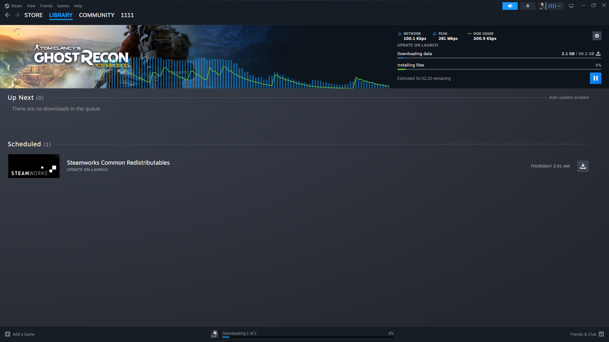
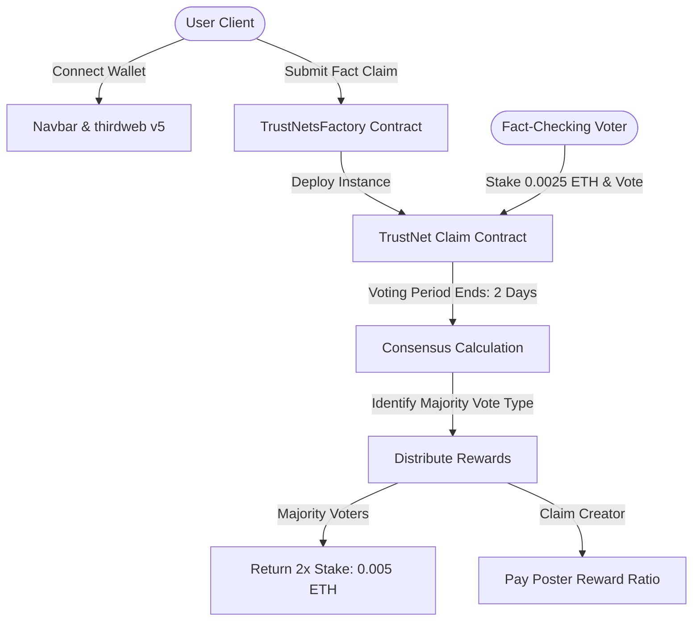

# 🛡️ TrustNet — Decentralized Fact-Checking & Claim Verification

[](https://nextjs.org/)
[](https://thirdweb.com/)
[](https://book.getfoundry.sh/)
[](https://sepolia.etherscan.io/)

> **TrustNet** is a futuristic, decentralized, crowd-sourced fact-checking platform. It leverages the Ethereum blockchain to allow community-driven truth verification using an on-chain staking, voting, and consensus mechanism.

---

## 📖 Academic Foundation & Thesis

This project is the practical implementation of the comprehensive research and design concepts presented in the thesis:

📌 **[Read the Full Thesis Document: Decentralized (thesis).pdf](./Decentralized%20(thesis).pdf)**

The thesis details the theoretical framework, mathematical models for reputation, game-theoretic analysis of consensus-driven voting, and the core smart contract architectures that prevent sybil attacks while rewarding honest fact-checkers.

---

## ⚡ Core Features

- 🔑 **Web3 Integration**: Seamless wallet connection using MetaMask and Coinbase via the high-performance **thirdweb v5 SDK**.
- 📝 **On-Chain Claim Submission**: Users can submit fact-checking claims (specifying titles, descriptions, categories, references, and image URLs) directly to the blockchain.
- ⚖️ **Staked Consensus Voting**: Voters stake testnet Sepolia ETH (`0.0025 ETH`) to vote on claims as *Valid*, *Invalid*, *Unverifiable*, or *Misleading*.
- 💰 **Consensus Reward Distribution**: After a 2-day voting period, the majority consensus is calculated. Voters in the majority get double their stake back, while the original claim poster receives a standard reward ratio.
- 🧠 **Personalized Preference Engine**: Analyze the user's past interaction preferences to recommend claims that require verification.
- 🚰 **Built-in Sepolia Faucet**: Integrated interactive faucet widget to obtain testnet Sepolia resources directly within the dApp UI.
- 🏆 **Reputation Leaderboard**: Gamified system tracking user contributions, levels, and fact-checking reputation.
- 🗺️ **Guided Interactive Tutorial**: Comprehensive user onboarding tour powered by `react-joyride` to teach new users how the platform works.

---

## 🌐 Platform Showcase & Visual Walkthrough

Here is a visual guided tour of the TrustNet application running locally.

### 1. Connection & Wallet Authentication
Connect your favorite Ethereum wallet to access on-chain actions. Once authenticated, your Sepolia balance and active wallet address will be visible in the navigation bar.

| Connecting Wallet | MetaMask Connected |
|---|---|
|  | *Auth integration powered by thirdweb* |

---

### 2. Main Dashboard & Fact Feed
The central hub of TrustNet features a rich category filter system, real-time claim sorting, and high-fidelity search.


*Figure: The responsive home dashboard displaying the catalog of claims with real-time status badges.*


*Figure: The detailed card feed showing claims under categories like Business, Geo Politics, Sports, and Technology.*

---

### 3. Claim Creation & Voting Lifecycle
Publish new verification nodes on-chain, or cast stakes on active claims.


*Figure: On-chain claim creation form with fields for Title, Description, Image, Source URI, and Category.*

---

### 4. Profiles & Leaderboard
Monitor your contributions, verify your personalized recommendations, and view the top fact-checkers in the community.


*Figure: User Profile showing personal metrics, levels, and custom factual claim history.*


*Figure: Real-time user reputation leaderboard displaying top contributors and their verification scores.*


*Figure: A dedicated management workspace for claims you have created.*

---

### 5. Concept & Conceptual Framework
Read detailed platform specs directly from the dApp UI's interactive about view.


*Figure: Detailed documentation showing how game-theoretic consensus alignment ensures factual integrity.*

---

## 🏗️ Technical Architecture

TrustNet implements a decentralized architecture split into an on-chain smart contract tier and a Next.js frontend application.



### On-Chain Smart Contracts (`./trustnetcontract`)

The core architecture follows a **Factory deployment pattern** to isolate states and conserve gas:

1. **`TrustNetsFactory.sol`**:
   - Manages global state and deployments.
   - Deploys new individual `TrustNet.sol` contract instances dynamically.
   - Enforces unique content checking by storing cryptographic hashes (`keccak256`) of claim contents to prevent duplicate spam.
   - Exposes read queries like `getAllClaims()` and `getUserClaims(address)`.

2. **`TrustNet.sol`**:
   - Represents a single claim node containing the metadata (title, description, source, category, poster).
   - Handles staked voting (`voteOnClaim`) where voters stake a fixed `0.0025 ETH` and cast a vote (`valid`, `invalid`, `unverifiable`, `misleading`).
   - Calculates majority consensus through `determineMajorityVote`.
   - Distributes game-theoretic rewards (`distributeRewards`) when the 2-day period completes, returning stakes to correct voters and paying out creator royalties.

---

## 🛠️ Developer Setup & Local Setup

To run Project TrustNet locally, ensure you have [Node.js v18+](https://nodejs.org/) installed.

### 1. Smart Contracts (Foundry Setup)
Navigate to the contracts directory:
```bash
cd trustnetcontract
```

Install dependencies and compile:
```bash
npm install
npm run build
```

Deploy the factory contract using thirdweb CLI:
```bash
npx thirdweb deploy
```
*Select **Sepolia Testnet** from the interactive console to deploy.*

---

### 2. Frontend Web Application (Next.js Setup)
Navigate to the web app directory:
```bash
cd ../trustnetapp
```

Create a local environment file `.env.local`:
```env
NEXT_PUBLIC_TEMPLATE_CLIENT_ID=your_thirdweb_client_id_here
```
*(Get a free Client ID from the [thirdweb dashboard](https://thirdweb.com/dashboard))*

Install dependencies:
```bash
npm install
```

Start the development server:
```bash
npm run dev
# Or for enhanced speed
npm run dev:turbo
```

The application will launch at **`http://localhost:3000`**.

---

## ⚙️ Dependencies

### Frontend (`trustnetapp`)
- **Framework**: Next.js 14 (App Router)
- **Web3 Interface**: `thirdweb` (v5 SDK) & `ethers` (v5)
- **Styling**: Tailwind CSS
- **Charts & Visualizations**: `chart.js` & `react-chartjs-2`
- **Tours & Guide**: `react-joyride`

### Contracts (`trustnetcontract`)
- **Solidity Compiler**: `^0.8.0`
- **Core Library**: `@openzeppelin/contracts` (ReentrancyGuard, SafeMath)
- **Development Toolchain**: Foundry & thirdweb CLI

---

## 📄 License & Intellectual Property

This project is open-source and developed in coordination with academic research. All theoretical concepts, formulas, and consensus design models belong to the author of the attached **[Decentralized Thesis](./Decentralized%20(thesis).pdf)**.
