<div align="center">
  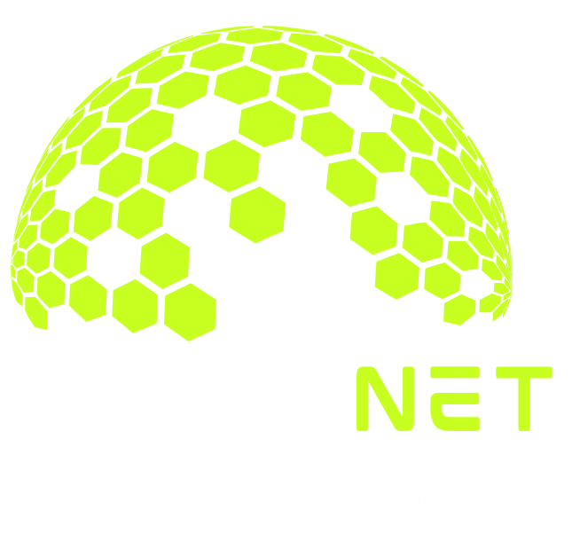

  <h1 align="center">TrustNet</h1>

  <p align="center">
    <strong>A Decentralized Fact-Checking and Claim Verification Ecosystem</strong>
    <br />
    Combating misinformation through economic incentives and crowd-sourced truth.
    <br />
    <a href="#about-the-project"><strong>Explore the docs »</strong></a>
    <br />
  </p>

  <p align="center">
    
    
    
    
  </p>
</div>

<details>
  <summary>Table of Contents</summary>
  <ol>
    <li><a href="#about-the-project">About The Project</a></li>
    <li><a href="#academic-foundation--thesis">Academic Foundation & Thesis</a></li>
    <li><a href="#app-interface">App Interface</a></li>
    <li><a href="#how-it-works">How It Works</a></li>
    <li><a href="#features--gamification">Features & Gamification</a></li>
    <li><a href="#smart-contract-architecture">Smart Contract Architecture</a></li>
    <li><a href="#getting-started">Getting Started</a></li>
    <li><a href="#license">License</a></li>
  </ol>
</details>

---

##  About The Project

**TrustNet** is a decentralized Web3 application built on the **Sepolia Testnet**. In an era where misinformation spreads rapidly, TrustNet provides a trustless environment where the community crowd-sources fact-checking. 

By tying economic stakes to votes, validators are financially incentivized to vote honestly. If a validator aligns with the majority consensus, they are rewarded. If they attempt to validate a false claim against the consensus, they lose their stake. This ensures a reliable, self-regulating feed of crowd-sourced truth.

---

##  Academic Foundation & Thesis

This project is the practical implementation of the comprehensive research, design concepts, and mathematical consensus models presented in the thesis:

📌 **[Read the Full Thesis Document: Decentralized (thesis).pdf](./Decentralized%20(thesis).pdf)**

The thesis details the theoretical framework, mathematical models for reputation, game-theoretic analysis of consensus-driven voting, and the core smart contract architectures that prevent sybil attacks while rewarding honest fact-checkers.

---

##  App Interface

We've designed a sleek, modern, and highly responsive user interface featuring a `zinc-950` dark mode theme.

| **Home / Discovery** | **Personalized Feed** |
| :---: | :---: |
| 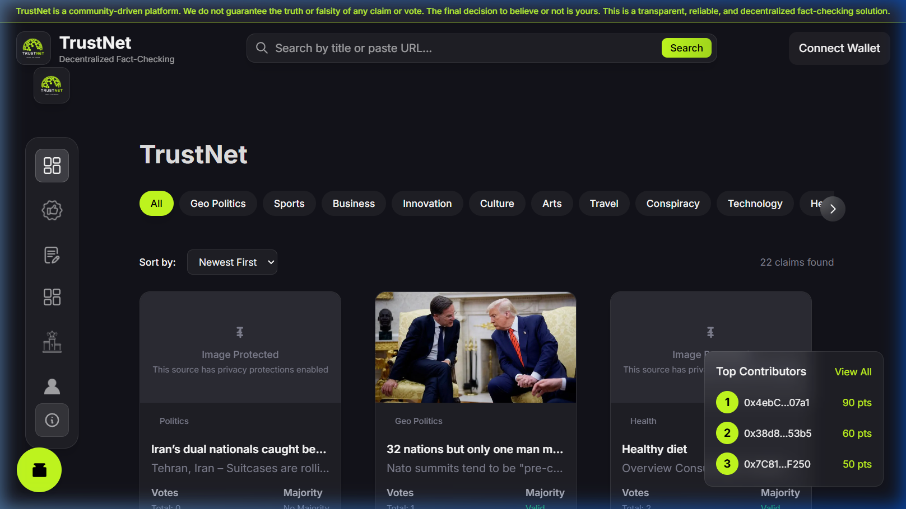 | 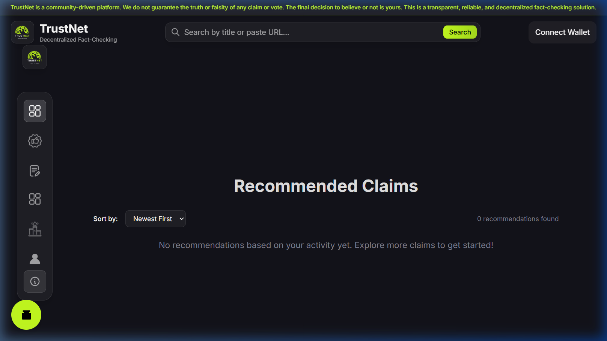 |
| *Browse trending claims across various categories.* | *View personalized recommendations and top contributors.* |

| **Create a Claim** | **Community Leaderboard** |
| :---: | :---: |
| 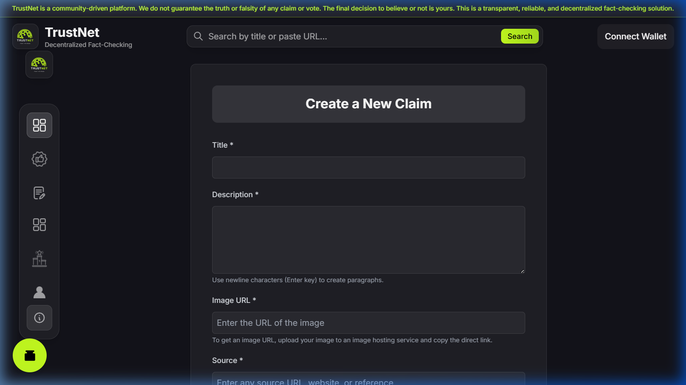 | 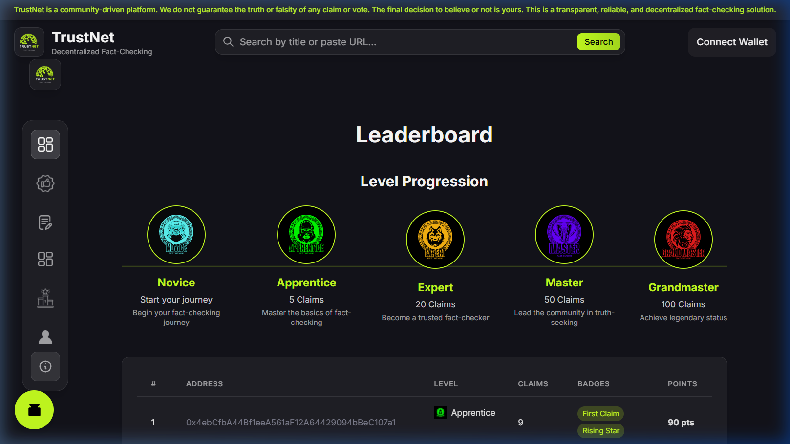 |
| *Submit detailed claims with external source links.* | *Track the most reliable fact-checkers in the ecosystem.* |

| **My Claims Workspace** | **User Profile Feed** |
| :---: | :---: |
| 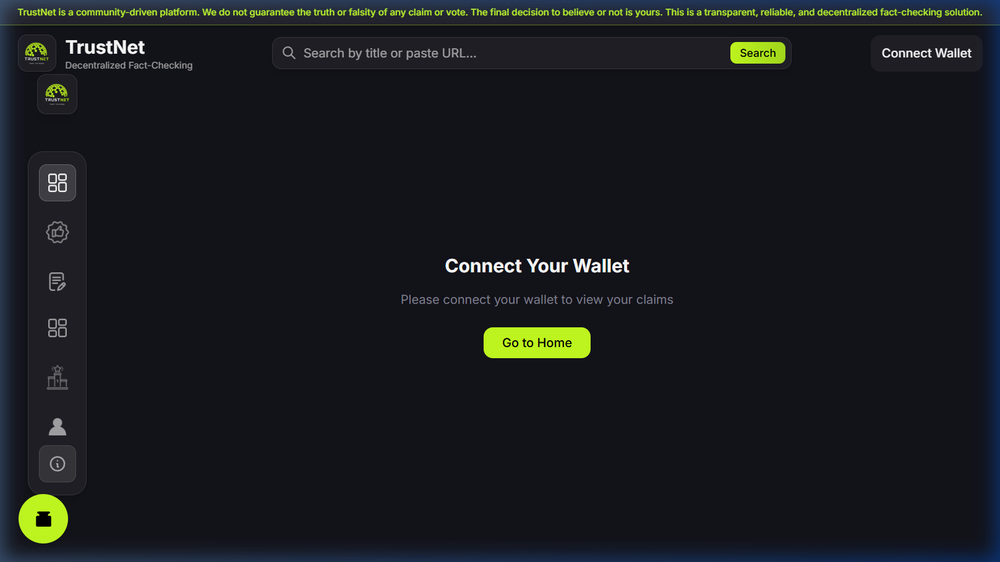 | 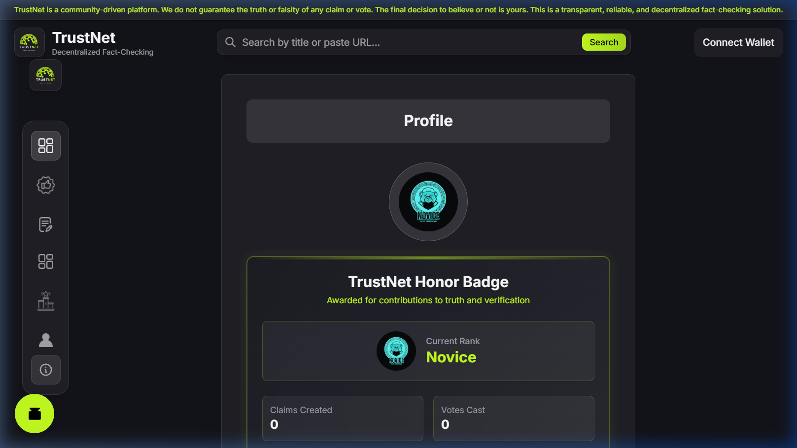 |
| *A dedicated management workspace for claims you have created.* | *Track your personal metrics, levels, and verification accuracy.* |

| **Conceptual Guide** |
| :---: |
| 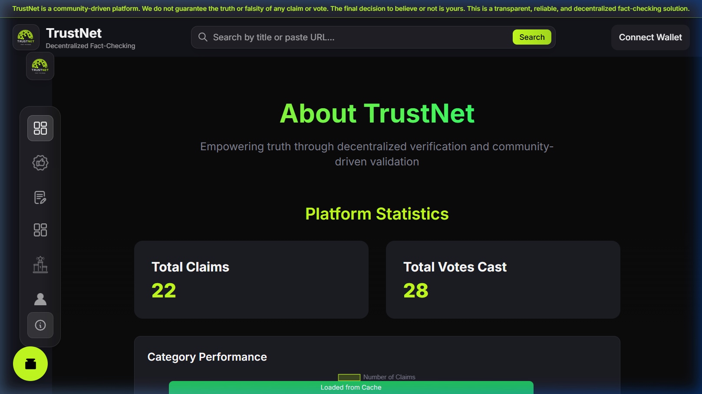 |
| *Detailed conceptual views on game-theoretic consensus.* |

---

##  How It Works

TrustNet relies on a straightforward, three-phase lifecycle for every piece of information:

1. **Submission Phase:** A user submits a claim (news, statement, or rumor) including a title, detailed description, image, and a source reference. They categorize it into predefined topics like *Politics*, *Geo Politics*, or *Health*.
2. **Staking & Voting Phase (48 Hours):** Community members review the claim. To cast a vote (`Valid`, `Invalid`, `Unverifiable`, or `Misleading`), the user must stake exactly **0.0025 Sepolia ETH**. 
3. **Resolution & Reward Phase:** Once the 48-hour window closes, the smart contract tallies the votes.
   - **Voters** who selected the winning outcome receive **2x their staked ETH** back.
   - **The Claim Poster** earns a **10% royalty** of the total reward pool for sparking the discussion.
   - **Minority voters** lose their stake.

---

##  Features & Gamification

To keep the community engaged, TrustNet includes built-in gamification:

- **Reputation Tiers:** Users earn points for participating and posting accurate claims. The system features dynamic badges:
  - 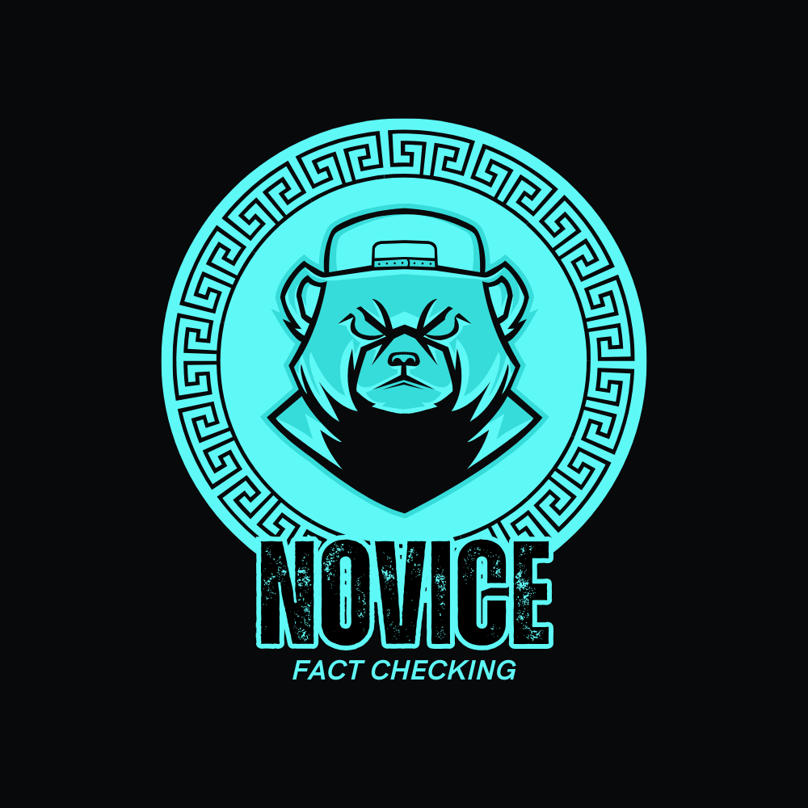 **Novice** & 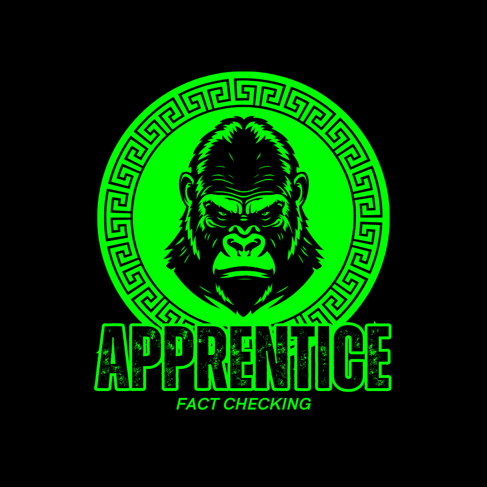 **Apprentice**
  -  **Expert**
  - 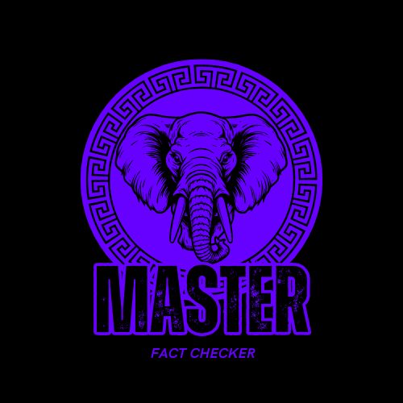 **Master** & 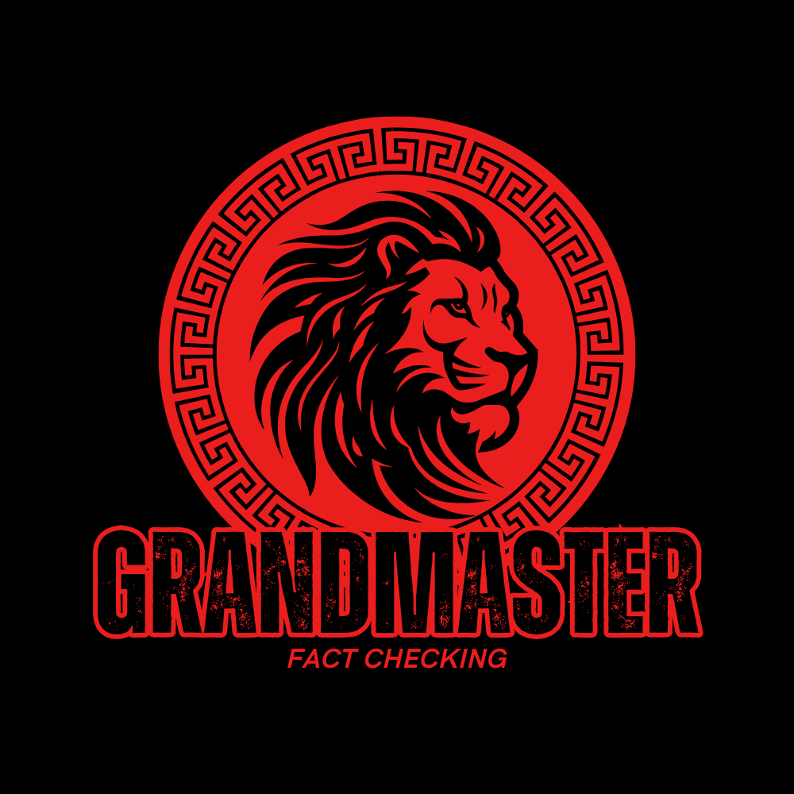 **Grandmaster**
- **Top Contributors Sidebar:** A live, updating component that highlights users with the highest accuracy and participation rates.
- **Categorization:** Advanced filtering allows users to only see claims relevant to their interests.

---

##  Smart Contract Architecture

The decentralized logic is entirely on-chain, utilizing two primary contracts written in Solidity:

### 1. `TrustNetsFactory.sol` (The Hub)
Acts as the central registry and deployer for the platform.
- **Duplicate Prevention:** Before creating a claim, it generates a `keccak256` hash of the `title`, `description`, `image`, `source`, and `category`. It checks a `contentHashes` mapping to ensure the exact same claim cannot be spammed.
- **Dynamic Deployment:** If the claim is unique, the Factory deploys a brand new, isolated `TrustNet` contract specifically for that claim.
- **User Portfolios:** Maintains a `userClaims` mapping so users can easily retrieve all the claims they have authored.

### 2. `TrustNet.sol` (The Claim Engine)
Each deployed claim operates as its own independent escrow and voting engine, secured by OpenZeppelin's `ReentrancyGuard`.
- **State Management:** Tracks the `Claim` details (title, description, image, etc.) and an array of `Vote` structs mapping voters to their choices.
- **Voting Mechanism (`voteOnClaim`):** Requires a strict `msg.value` of exactly **0.0025 Sepolia ETH**. It ensures users cannot vote twice via a `hasVoted` mapping.
- **Resolution (`determineMajorityVote`):** A view function that tallies the Valid, Invalid, Unverifiable, and Misleading counters. If one choice secures strictly more than 50% of the total votes, it is declared the majority.
- **Reward Distribution (`distributeRewards`):** 
  - Can only be called after the `votingPeriod` (2 days) has expired.
  - Automatically calculates the total reward pool.
  - Distributes a fixed **10% ratio** (`claimPosterRewardRatio`) of the winning pool to the original claim creator.
  - Iterates through the winning voters and transfers **0.005 ETH** (a 2x return on their initial 0.0025 ETH stake).
  - Uses batch processing limits to prevent Block Gas Limit DoS attacks when iterating through voters.

---

##  Getting Started

Follow these instructions to set up the project locally.

### Prerequisites
- [Node.js](https://nodejs.org/en/) (v18 or higher)
- [Yarn](https://yarnpkg.com/)
- [Foundry](https://getfoundry.sh/) (For compiling smart contracts)

### 1. Clone the Repository
```bash
git clone https://github.com/Damith-Pathirana/Project-TrustNet.git
cd Project-TrustNet
```

### 2. Smart Contract Setup
Navigate into the contract directory to compile and deploy:
```bash
cd trustnetcontract
yarn install
yarn build
yarn deploy
```
*(Deploying will open a thirdweb dashboard link where you can execute the deployment transaction).*

### 3. Frontend Setup
Navigate to the application directory:
```bash
cd ../trustnetapp
yarn install
```

### 4. Environment Variables
Create a new file named `.env.local` in the `trustnetapp` root directory. Add your API keys using the format below. 
>  **IMPORTANT:** Never commit your actual API keys to GitHub. The `.env.local` file is ignored by git automatically.

```env
# Replace the placeholder below with your actual Client ID from the thirdweb dashboard
NEXT_PUBLIC_TEMPLATE_CLIENT_ID=<ADD_YOUR_THIRDWEB_CLIENT_ID_HERE>
```

### 5. Run the App
Start the Next.js development server:
```bash
yarn dev
```
Navigate to `http://localhost:3000` in your browser to interact with the dApp.

---

##  License

This project is licensed under a **Source-Available License**. 

- **Personal Use & Contributions**: You are free to view, fork, and contribute to this project.
- **Commercial Use**: Requires express written permission and a separate commercial license agreement.
- **Unauthorized Use**: Use without notification and payment is strictly prohibited.

For commercial inquiries or usage permissions, please contact the repository owner. See the [LICENSE](LICENSE) file for the full legal text.
